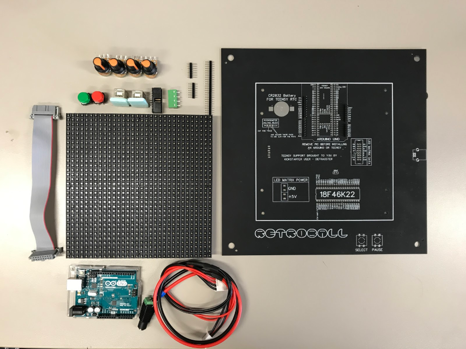
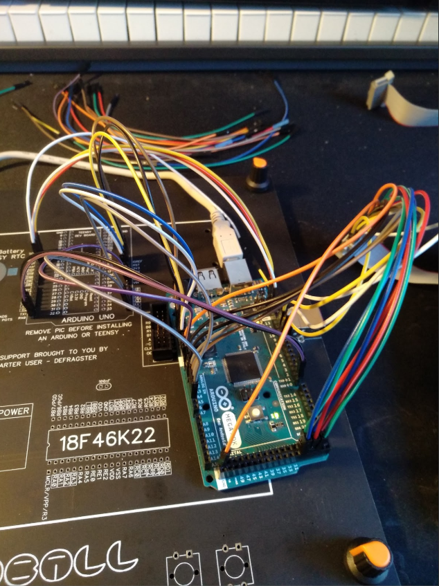
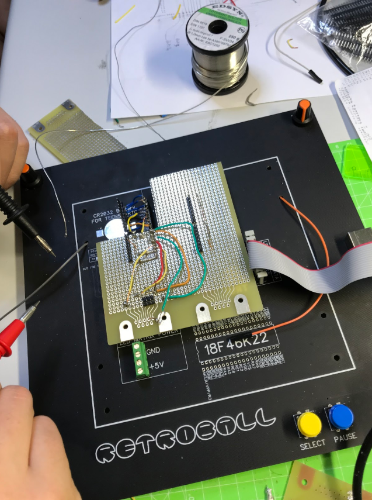
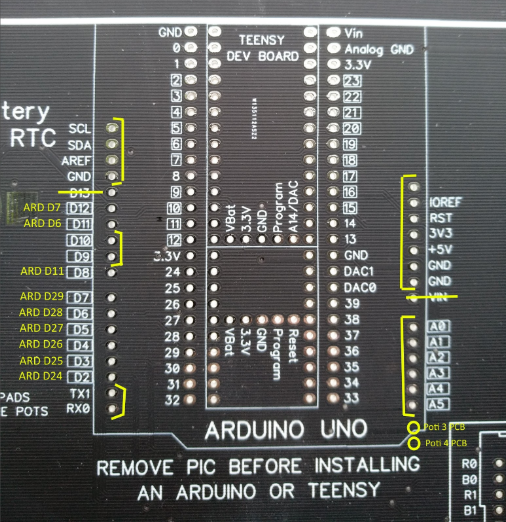

  

**Poooong** is a classic pixel fun console, like in the old good days. A console allows you to play with two and four players and switch between eazy
and hard modes (1 and 3 balls).
 
###### Inspired by [The Super Pong Table](https://bradsprojects.com/the-super-pong-table-2/)

Hardware             |  Arduino Test In Progress
:-------------------------:|:-------------------------:
 | 

Custom Component 1             |  Custom Component 2
:-------------------------:|:-------------------------:
 | 

## Gameplay

  

